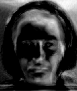

# Computer Vision Playground

## Object segmentation using K-Means Clustering

### M and M's

|K = 4|K = 6|K = 8|
|-|-|-|
||||

### Peppers

|K = 4|K = 6|K = 8|
|-|-|-|
||||

## Face recognition with Piecewise Component Analysis (PCA)

|||
|-|-|
|Mean Face||
|Eigenfaces|  |
|||
|||
|||
|||
|||
|||
|||
|||
|||
|||

## Homography

